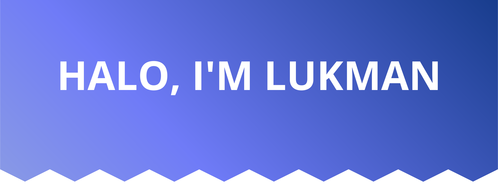

# Salam kenal, nama saya **Lukman Sanusi**
Saya adalah seorang mahasiswa Teknik yang sekarang sedang memasuki semester 7. Sekarang ini saya sedang berfokus mengembangkan pengetahuan dan kemampuan saya dalam pengembangan perangkat lunak.
 
 

### Accounts:

  

### Languages and Tools:

  

### Software:

  

---

